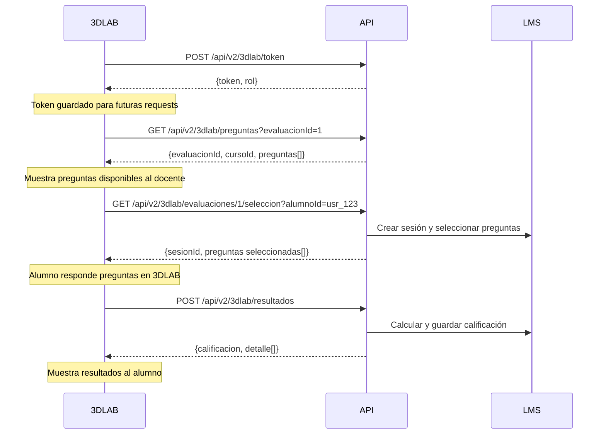

# Guía de Integración - Sistema 3DLAB

## Índice
1. [Introducción](#introducción)
2. [Credenciales de Acceso](#credenciales-de-acceso)
3. [Configuración Inicial](#configuración-inicial)
4. [Autenticación](#autenticación)
5. [Endpoints Disponibles](#endpoints-disponibles)
6. [Modelos de Datos](#modelos-de-datos)
7. [Flujo de Trabajo Completo](#flujo-de-trabajo-completo)
8. [Ejemplos de Uso](#ejemplos-de-uso)
9. [Códigos de Error](#códigos-de-error)
10. [Notas Importantes](#notas-importantes)

---

## Introducción

Este documento describe cómo integrar el sistema 3DLAB con el backend del LMS para la gestión de laboratorios interactivos. El sistema permite a 3DLAB:

- Obtener preguntas de evaluación de laboratorios
- Crear sesiones de evaluación para alumnos
- Registrar resultados y calificaciones automáticamente

---

## Credenciales de Acceso

### Usuario de Integración (Sistema)

El sistema LMS ha creado un usuario especial para la integración de 3DLAB:

```
Email: 3dlab@laboratorio.edu
Contraseña: 3DLab@2025!Secure
RUT: 99999999-9
Nombre: Integración 3DLAB
Rol: Alumno
```

### API Key para Endpoints 3DLAB

Todos los endpoints de la API `/api/v2/3dlab/*` requieren el siguiente header:

```
X-3DLAB-Key: 3DLAB-SECRET-KEY-CHANGE-IN-PRODUCTION
```

**IMPORTANTE**: Esta API Key debe cambiarse en producción por razones de seguridad.

### Curso de Prueba

El sistema ha creado automáticamente:

- **Curso**: "3DLAB Laboratorio"
- **Descripción**: Curso de prueba para integración con 3DLAB
- El usuario de integración está inscrito en este curso
- Contiene un laboratorio de prueba con 8 preguntas de ejemplo

---

## Configuración Inicial

### URLs del Sistema

```
Desarrollo: http://localhost:5000
Producción: [URL a definir]
```

### Base Path de API

```
/api/v2/3dlab
```

---

## Autenticación

### 1. Obtener Token JWT (Sin Expiración)

El usuario de integración 3DLAB tiene privilegios especiales: su token JWT **NO expira**, permitiendo mantener una sesión permanente.

**Endpoint**:
```
POST /api/v2/3dlab/token
```

**Headers**:
```
X-3DLAB-Key: 3DLAB-SECRET-KEY-CHANGE-IN-PRODUCTION
```

**Response**:
```json
{
  "token": "eyJhbGciOiJIUzI1NiIsInR5cCI6IkpXVCJ9...",
  "rol": "Alumno"
}
```

### 2. Usar el Token en Requests Autenticados

Para endpoints que requieren autenticación JWT (fuera de `/api/v2/3dlab/*`), incluir:

```
Authorization: Bearer {token}
```

---

## Endpoints Disponibles

### 1. Obtener Preguntas de un Laboratorio

Obtiene todas las preguntas disponibles en un laboratorio específico.

**Endpoint**:
```
GET /api/v2/3dlab/preguntas?evaluacionId={id}
```

**Headers**:
```
X-3DLAB-Key: 3DLAB-SECRET-KEY-CHANGE-IN-PRODUCTION
```

**Query Parameters**:
- `evaluacionId` (int, requerido): ID de la evaluación/laboratorio

**Response 200 OK**:
```json
{
  "evaluacionId": 1,
  "cursoId": 1001,
  "preguntas": [
    {
      "idPregunta": 1,
      "enunciado": "¿Cuál es el resultado de 2 + 2?",
      "opciones": {
        "a": "3",
        "b": "4",
        "c": "5",
        "d": "6"
      }
    },
    {
      "idPregunta": 2,
      "enunciado": "¿Cuál es la capital de Chile?",
      "opciones": {
        "a": "Valparaíso",
        "b": "Santiago",
        "c": "Concepción",
        "d": "La Serena"
      }
    }
  ]
}
```

**Errores**:
- `404`: Evaluación no encontrada
- `400`: La evaluación no está configurada como laboratorio 3DLAB
- `409`: El laboratorio no tiene suficientes preguntas

---

### 2. Crear Sesión y Obtener Selección de Preguntas

Crea una nueva sesión de evaluación para un alumno y selecciona aleatoriamente un subconjunto de preguntas.

**Endpoint**:
```
GET /api/v2/3dlab/evaluaciones/{evaluacionId}/seleccion?alumnoId={id}
```

**Headers**:
```
X-3DLAB-Key: 3DLAB-SECRET-KEY-CHANGE-IN-PRODUCTION
```

**Path Parameters**:
- `evaluacionId` (int, requerido): ID de la evaluación/laboratorio

**Query Parameters**:
- `alumnoId` (string, requerido): ID del alumno que realizará el laboratorio

**Response 200 OK**:
```json
{
  "sesionId": "a1b2c3d4-e5f6-7890-abcd-ef1234567890",
  "evaluacionId": 1,
  "cursoId": 1001,
  "alumnoId": "usr_123456",
  "preguntas": [
    {
      "idPregunta": 1,
      "enunciado": "¿Cuál es el resultado de 2 + 2?",
      "opciones": {
        "a": "3",
        "b": "4",
        "c": "5",
        "d": "6"
      }
    },
    {
      "idPregunta": 3,
      "enunciado": "¿Cuántos días tiene una semana?",
      "opciones": {
        "a": "5",
        "b": "6",
        "c": "7",
        "d": "8"
      }
    }
  ]
}
```

**Notas**:
- El `sesionId` es único y debe usarse para registrar los resultados
- La cantidad de preguntas seleccionadas está definida en la configuración del laboratorio
- Cada llamada crea una nueva sesión (nuevo intento)

**Errores**:
- `404`: Evaluación o alumno no encontrado
- `400`: La evaluación no está configurada como laboratorio 3DLAB o alumnoId no proporcionado
- `409`: Configuración inválida del laboratorio

---

### 3. Registrar Resultados

Registra las respuestas del alumno y calcula la calificación automáticamente.

**Endpoint**:
```
POST /api/v2/3dlab/resultados
```

**Headers**:
```
X-3DLAB-Key: 3DLAB-SECRET-KEY-CHANGE-IN-PRODUCTION
Content-Type: application/json
```

**Request Body**:
```json
{
  "sesionId": "a1b2c3d4-e5f6-7890-abcd-ef1234567890",
  "evaluacionId": 1,
  "alumnoId": "usr_123456",
  "respuestas": [
    {
      "preguntaId": 1,
      "seleccion": "b"
    },
    {
      "preguntaId": 3,
      "seleccion": "c"
    }
  ]
}
```

**Validaciones**:
- `seleccion` debe ser una letra entre 'a' y 'd' (case-insensitive)
- Debe incluir respuesta para cada pregunta de la sesión
- No puede enviar dos veces respuestas para la misma sesión

**Response 200 OK**:
```json
{
  "evaluacionId": 1,
  "alumnoId": "usr_123456",
  "puntajeObtenido": 20,
  "puntajeMaximo": 20,
  "calificacion": 7.0,
  "detalle": [
    {
      "preguntaId": 1,
      "enunciado": "¿Cuál es el resultado de 2 + 2?",
      "seleccion": "B",
      "esCorrecta": true,
      "puntosOtorgados": 10,
      "puntosPregunta": 10,
      "retroalimentacion": null
    },
    {
      "preguntaId": 3,
      "enunciado": "¿Cuántos días tiene una semana?",
      "seleccion": "C",
      "esCorrecta": true,
      "puntosOtorgados": 10,
      "puntosPregunta": 10,
      "retroalimentacion": null
    }
  ],
  "fechaCalificacion": "2025-01-15T10:30:00Z"
}
```

**Sistema de Calificación**:
- Escala chilena: 1.0 a 7.0
- Fórmula: `calificacion = (puntajeObtenido / puntajeMaximo) * 6 + 1`
- La calificación se guarda automáticamente en el sistema

**Errores**:
- `404`: Sesión no encontrada
- `400`: Datos inválidos (alumnoId no coincide, opciones inválidas, etc.)
- `409`: Sesión ya completada

---

## Modelos de Datos

### Curso

```typescript
interface Curso {
  nrc: number;              // ID único del curso
  nombre: string;           // Nombre del curso
  descripcion: string;      // Descripción del curso
  activo: boolean;          // Estado del curso
  administradorId: string;  // ID del docente administrador
}
```

### Evaluación (Laboratorio)

```typescript
interface Evaluacion {
  id: number;                           // ID único de la evaluación
  titulo: string;                       // Título del laboratorio
  descripcion: string;                  // Descripción del laboratorio
  cursoId: number;                      // ID del curso (NRC)
  docenteId: string;                    // ID del docente creador
  fechaCreacion: string;                // Fecha de creación (ISO 8601)
  fechaInicio: string;                  // Fecha de inicio (ISO 8601)
  fechaFin: string;                     // Fecha de fin (ISO 8601)
  tiempoLimiteMins: number;             // Tiempo límite en minutos
  activa: boolean;                      // Estado activo/inactivo
  intentosMaximos: number;              // Número máximo de intentos
  esLaboratorio3DLab: boolean;          // true para laboratorios 3DLAB
  preguntasMinimasLaboratorio: number;  // Preguntas mínimas requeridas
  preguntasPorSesionLaboratorio: number;// Preguntas por sesión
}
```

### Pregunta

```typescript
interface Pregunta {
  id: number;           // ID único de la pregunta
  evaluacionId: number; // ID de la evaluación
  texto: string;        // Enunciado de la pregunta
  puntos: number;       // Puntos de la pregunta
  orden: number;        // Orden de la pregunta
  opciones: Opcion[];   // Lista de opciones
}
```

### Opción

```typescript
interface Opcion {
  id: number;          // ID único de la opción
  preguntaId: number;  // ID de la pregunta
  texto: string;       // Texto de la opción
  esCorrecta: boolean; // true si es la respuesta correcta
  orden: number;       // Orden de la opción (mapea a letras a-d)
}
```

### Usuario

```typescript
interface Usuario {
  id: string;          // ID único del usuario
  email: string;       // Email del usuario
  nombre: string;      // Nombre completo
  rut: string;         // RUT chileno
  rol: string;         // Rol: "Alumno", "Docente", "Administrador"
}
```

---

## Flujo de Trabajo Completo

### Escenario: Alumno Realiza un Laboratorio 3DLAB



### Pasos Detallados

1. **Autenticación Inicial** (Una sola vez)
   - 3DLAB obtiene token JWT sin expiración
   - Guarda el token para todas las requests futuras

2. **Consulta de Preguntas** (Opcional)
   - Permite ver todas las preguntas disponibles del laboratorio
   - Útil para que docentes configuren el laboratorio en 3DLAB

3. **Inicio de Sesión de Alumno**
   - 3DLAB solicita crear sesión para un alumno específico
   - LMS crea la sesión y selecciona preguntas aleatorias
   - Retorna `sesionId` único y preguntas seleccionadas

4. **Alumno Responde en 3DLAB**
   - Alumno interactúa con el entorno 3D
   - 3DLAB recopila las respuestas seleccionadas

5. **Envío de Resultados**
   - 3DLAB envía respuestas con el `sesionId`
   - LMS valida, calcula calificación y guarda en BD
   - Retorna calificación y detalle de respuestas

---

## Ejemplos de Uso

### Ejemplo 1: Obtener Token (cURL)

```bash
curl -X POST http://localhost:5000/api/v2/3dlab/token \
  -H "X-3DLAB-Key: 3DLAB-SECRET-KEY-CHANGE-IN-PRODUCTION"
```

**Response**:
```json
{
  "token": "eyJhbGciOiJIUzI1NiIsInR5cCI6IkpXVCJ9.eyJzdWIiOiJ1c3JfMTIzIiwiZW1haWwiOiIzZGxhYkBsYWJvcmF0b3Jpby5lZHUiLCJub21icmUiOiJJbnRlZ3JhY2nDs24gM0RMQUIiLCJyb2xlIjoiQWx1bW5vIn0.xyz...",
  "rol": "Alumno"
}
```

---

### Ejemplo 2: Obtener Preguntas (cURL)

```bash
curl -X GET "http://localhost:5000/api/v2/3dlab/preguntas?evaluacionId=1" \
  -H "X-3DLAB-Key: 3DLAB-SECRET-KEY-CHANGE-IN-PRODUCTION"
```

---

### Ejemplo 3: Crear Sesión (JavaScript/Fetch)

```javascript
const evaluacionId = 1;
const alumnoId = "usr_123456";

const response = await fetch(
  `http://localhost:5000/api/v2/3dlab/evaluaciones/${evaluacionId}/seleccion?alumnoId=${alumnoId}`,
  {
    method: 'GET',
    headers: {
      'X-3DLAB-Key': '3DLAB-SECRET-KEY-CHANGE-IN-PRODUCTION'
    }
  }
);

const data = await response.json();
console.log('Sesión creada:', data.sesionId);
console.log('Preguntas asignadas:', data.preguntas);
```

---

### Ejemplo 4: Enviar Resultados (Python)

```python
import requests

url = "http://localhost:5000/api/v2/3dlab/resultados"
headers = {
    "X-3DLAB-Key": "3DLAB-SECRET-KEY-CHANGE-IN-PRODUCTION",
    "Content-Type": "application/json"
}
payload = {
    "sesionId": "a1b2c3d4-e5f6-7890-abcd-ef1234567890",
    "evaluacionId": 1,
    "alumnoId": "usr_123456",
    "respuestas": [
        {"preguntaId": 1, "seleccion": "b"},
        {"preguntaId": 3, "seleccion": "c"}
    ]
}

response = requests.post(url, json=payload, headers=headers)
resultado = response.json()

print(f"Calificación: {resultado['calificacion']}")
print(f"Puntaje: {resultado['puntajeObtenido']}/{resultado['puntajeMaximo']}")
```

---

### Ejemplo 5: Flujo Completo (TypeScript)

```typescript
class ThreeDLabClient {
  private apiKey = '3DLAB-SECRET-KEY-CHANGE-IN-PRODUCTION';
  private baseUrl = 'http://localhost:5000/api/v2/3dlab';
  private token?: string;

  async authenticate(): Promise<void> {
    const response = await fetch(`${this.baseUrl}/token`, {
      method: 'POST',
      headers: { 'X-3DLAB-Key': this.apiKey }
    });
    const data = await response.json();
    this.token = data.token;
  }

  async obtenerPreguntas(evaluacionId: number) {
    const response = await fetch(
      `${this.baseUrl}/preguntas?evaluacionId=${evaluacionId}`,
      {
        headers: { 'X-3DLAB-Key': this.apiKey }
      }
    );
    return await response.json();
  }

  async crearSesion(evaluacionId: number, alumnoId: string) {
    const response = await fetch(
      `${this.baseUrl}/evaluaciones/${evaluacionId}/seleccion?alumnoId=${alumnoId}`,
      {
        headers: { 'X-3DLAB-Key': this.apiKey }
      }
    );
    return await response.json();
  }

  async enviarResultados(sesionId: string, evaluacionId: number,
                         alumnoId: string, respuestas: any[]) {
    const response = await fetch(`${this.baseUrl}/resultados`, {
      method: 'POST',
      headers: {
        'X-3DLAB-Key': this.apiKey,
        'Content-Type': 'application/json'
      },
      body: JSON.stringify({
        sesionId,
        evaluacionId,
        alumnoId,
        respuestas
      })
    });
    return await response.json();
  }
}

// Uso
const client = new ThreeDLabClient();
await client.authenticate();

const preguntas = await client.obtenerPreguntas(1);
console.log('Preguntas disponibles:', preguntas);

const sesion = await client.crearSesion(1, 'usr_123456');
console.log('Sesión creada:', sesion.sesionId);

const resultado = await client.enviarResultados(
  sesion.sesionId,
  1,
  'usr_123456',
  [
    { preguntaId: 1, seleccion: 'b' },
    { preguntaId: 3, seleccion: 'c' }
  ]
);
console.log('Calificación:', resultado.calificacion);
```

---

## Códigos de Error

| Código | Descripción | Solución |
|--------|-------------|----------|
| 400 | Bad Request - Datos inválidos | Verificar formato de request body y parámetros |
| 401 | Unauthorized - API Key inválida | Verificar header `X-3DLAB-Key` |
| 404 | Not Found - Recurso no encontrado | Verificar IDs de evaluación, alumno, etc. |
| 409 | Conflict - Estado inválido | Sesión ya completada o configuración incorrecta |
| 500 | Internal Server Error | Contactar al administrador del sistema |

---

## Notas Importantes

### Seguridad

1. **API Key**: La API Key debe mantenerse confidencial y cambiar en producción
2. **Token JWT**: Aunque no expira, debe almacenarse de forma segura
3. **HTTPS**: En producción, usar siempre HTTPS

### Performance

1. **Token Único**: Obtener el token una sola vez al inicio, no en cada request
2. **Caché de Preguntas**: Cachear las preguntas del laboratorio si no cambian frecuentemente
3. **Timeouts**: Implementar timeouts razonables (30-60 segundos)

### Validaciones

1. **Alumno Existente**: El `alumnoId` debe corresponder a un usuario registrado en el LMS
2. **Evaluación Activa**: La evaluación debe estar activa y dentro del rango de fechas
3. **Respuestas Completas**: Debe enviar respuesta para todas las preguntas de la sesión

### Límites

1. **Intentos**: Los laboratorios 3DLAB tienen intentos ilimitados (IntentosMaximos = 0)
2. **Tiempo**: Sin límite de tiempo para laboratorios 3DLAB (TiempoLimiteMins = 0)
3. **Preguntas**: Mínimo 5 preguntas por laboratorio (configurable)

### Datos de Prueba

Después de iniciar la aplicación, el sistema crea automáticamente:

- Usuario: `3dlab@laboratorio.edu`
- Curso: "3DLAB Laboratorio"
- Laboratorio con 8 preguntas de ejemplo
- El laboratorio está configurado para seleccionar 5 preguntas por sesión

Para obtener el ID de la evaluación de prueba, consultar los logs del servidor al iniciar.

---

## Soporte

Para soporte técnico o consultas sobre la integración:

- **Documentación API**: [URL de Swagger/OpenAPI]
- **Logs**: Todos los requests se registran con prefijo "3DLAB:" en los logs del servidor
- **Contacto**: [Email del equipo de desarrollo]

---

## Changelog

### v1.0 - 2025-01-15
- Implementación inicial de integración 3DLAB
- Endpoints para obtener preguntas, crear sesiones y registrar resultados
- Token JWT sin expiración para usuario de integración
- Curso y laboratorio de prueba automático
